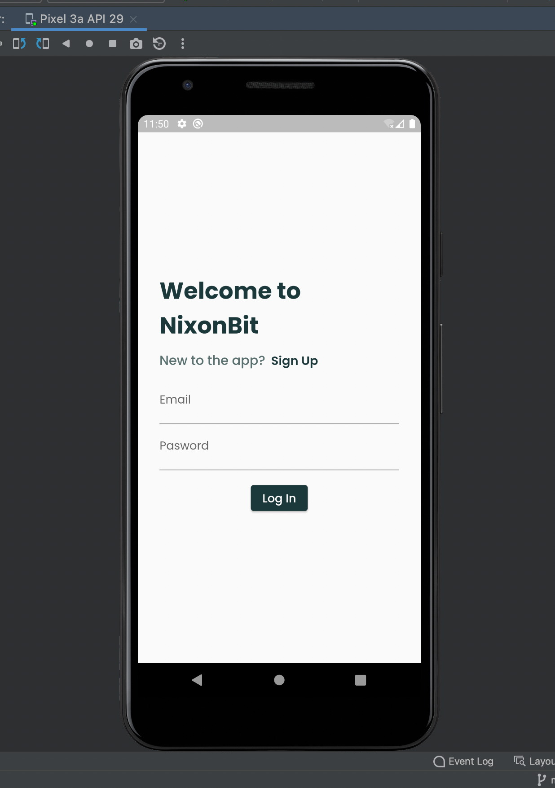

# Flutter-basics
 Contains all the basic flutter projects that I build while learning Flutter and Dart.

 ## Nixonit
A new Flutter project that I built for a internship assignment.
 ### NixonBit Screenshots:
 

 
 
 

## DEMO SHOP APP

1. Authentication Screen - Signup and Login using Firebase Auth API. 
2. Products Screen - Products are stored on Firebase Realtime Database.
3. Cart Screen - with Ordering Option, Favorites Screen, Order Screen.
4. Product Management Screen - with Add New and Edit Option.
5. Favorites, Cart-Order, Product Management options are USER SPECIFIC.
6. Auto Login, Auto Logout added.
(7). Animation - will be added.

Tech Used : Flutter, Firebase.
Packages Used : Provider - State Management, 
                Shared Preferences - Storing Auth Data on Device.

### Screenshots

## DEMO-BEE

This is Garage Provider app demo, that I made for a internship round.
### Screenshots

 

## CONVERSE - FLUTTER CHAT APP

This is realtime group messaging application that is available for Android as well as iOS. 

### TECH STACK : 
Flutter, Firebase.
### PACKAGES : 
Firebase Core, Cloud Firestore, Firebase Auth, ... .
### Screenshots : 
    will be added soon.